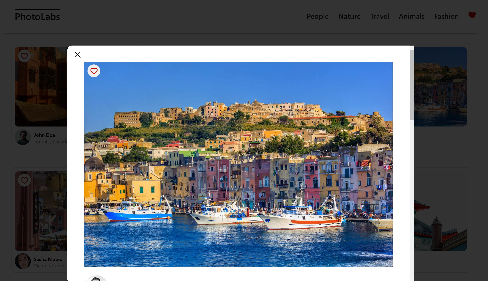

# Photolabs
Welcome to PhotoLabs, an app where you can explore and like a vast collection of photos! With PhotoLabs, you can easily search for photos by topic, view them in detail, and discover related images that pique your interest.

## Table of Contents
- [Description](#description)
- [Features](#features)
- [Installation](#installation)
- [Usage](#usage)

## Description
PhotoLabs is a client-side single-page application (SPA) built with React, allowing users to browse and interact with a captivating gallery of photos. Leveraging the power of the React view-layer library, PhotoLabs provides a seamless and immersive experience for photo enthusiasts.
### Screenshots
#### Homepage

#### Modal View



## Features
- Browse and explore a vast collection of photos from various categories.
- Click on any photo to view it in a larger, more detailed format using the Modal View feature.
- Discover suggested photos related to the one you are currently viewing.
- Like photos that catch your attention, providing a personalized collection of liked photos.
- Stay informed about your liked photos through a heart icon with a notification in the navigation.
## Dependencies
#### Front-end
- Axios
- react
- react-dom
- react-scripts
- web-vitals

#### Back-end
- body-parser
- cors
- dotenv
- express
- helmet
- pg
- socket.io
- ws
  
## Installation
Install dependencies with `npm install` in each respective `/frontend` and `/backend`.
### [Frontend] Running Webpack Development Server
```sh
cd frontend
npm start
```

### [Backend] Running Backend Servier
Read `backend/readme` for further setup details. Or simply run.
```sh
cd backend
npm start
```

## Usage
Once you have the app up and running, you can:
* Browse the homepage to view a collection of photos retrieved from the API.
* Use the navigation to explore different photo categories or topics.
* Click on a photo to enter Modal View and see a larger version of the selected image.
* While in Modal View, discover suggested photos that align with your interests.
* Like any photo by interacting with the relevant UI element associated with each photo.
* Keep track of your liked photos through the heart icon in the navigation, which displays a notification when you have liked photos.
